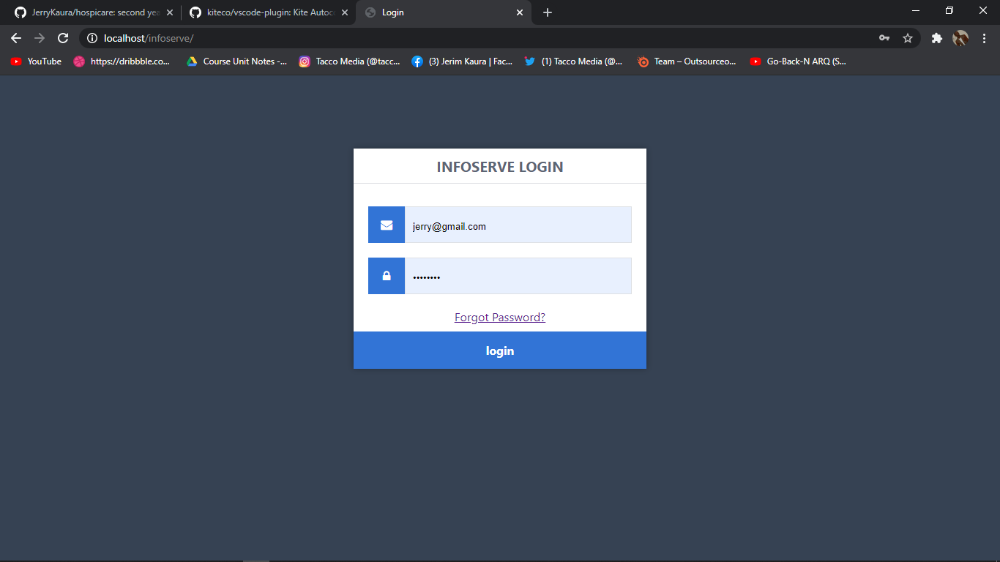
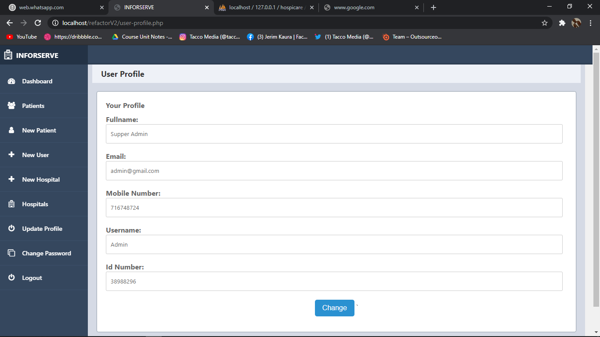
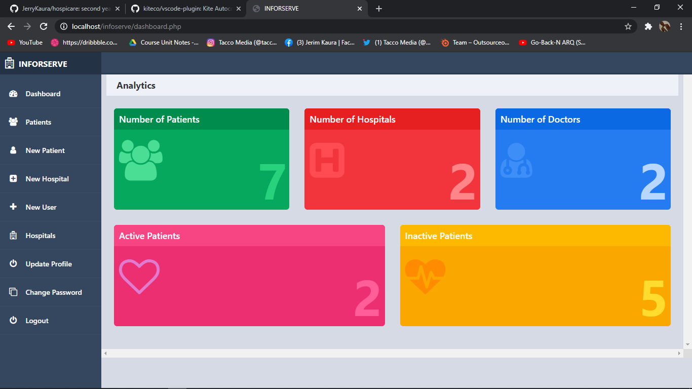
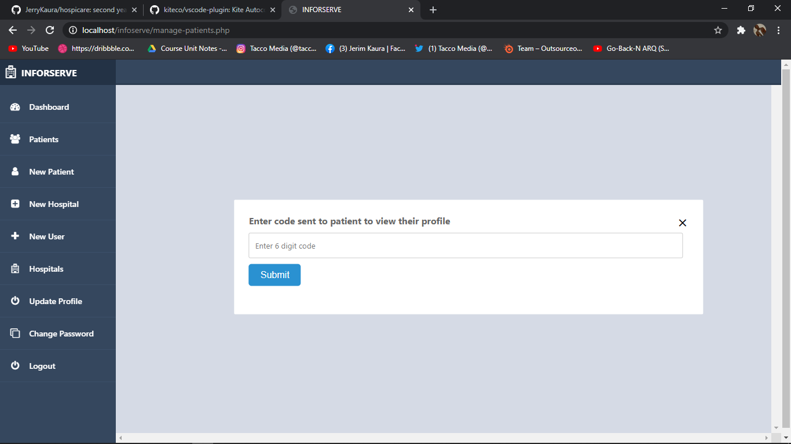
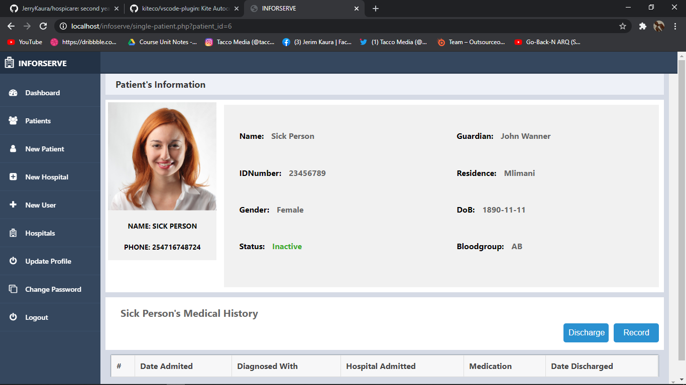

## INFORSERVE
This system keeps patients information on one single database that can be accessed by every other hospital running the system

### INSTALLING THE SYSTEM
1. Clone or download the project from the github repository.
2. Extract the file into the `htdocs` folder in xampp
3. Export the `hospicare.sql` file in the database folder to `phpMyadmin`
4. Open the admin on apache server. You will find the folder `inforserve`

### LOGIN CREDENTIALS
Login using the following creditials
1. Email: `jerry@gmail.com`
2. Password: `12345678`

### USER INTERFACE SCREENSHOTS

#### Login page

#### Update user profile

#### Admin dashborad

#### Code sent

#### Patient information page

### THE MESSAGE SERVICE
To send the security code mesage to your apatients before thier data is accessed, you need to setup an account with Africastalking for the messaging service.
